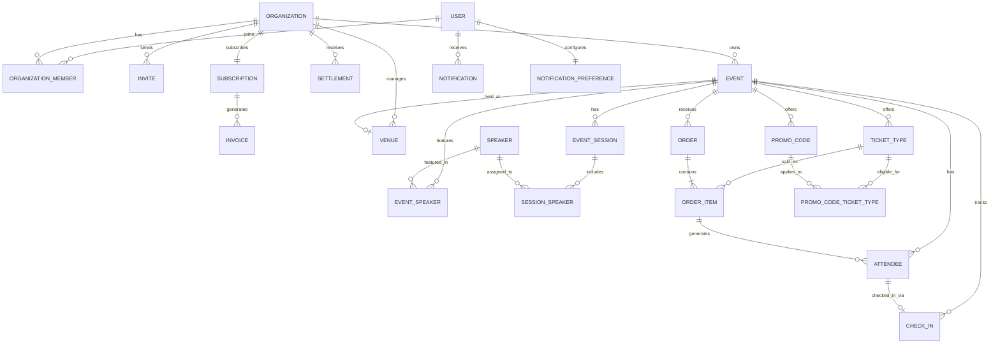
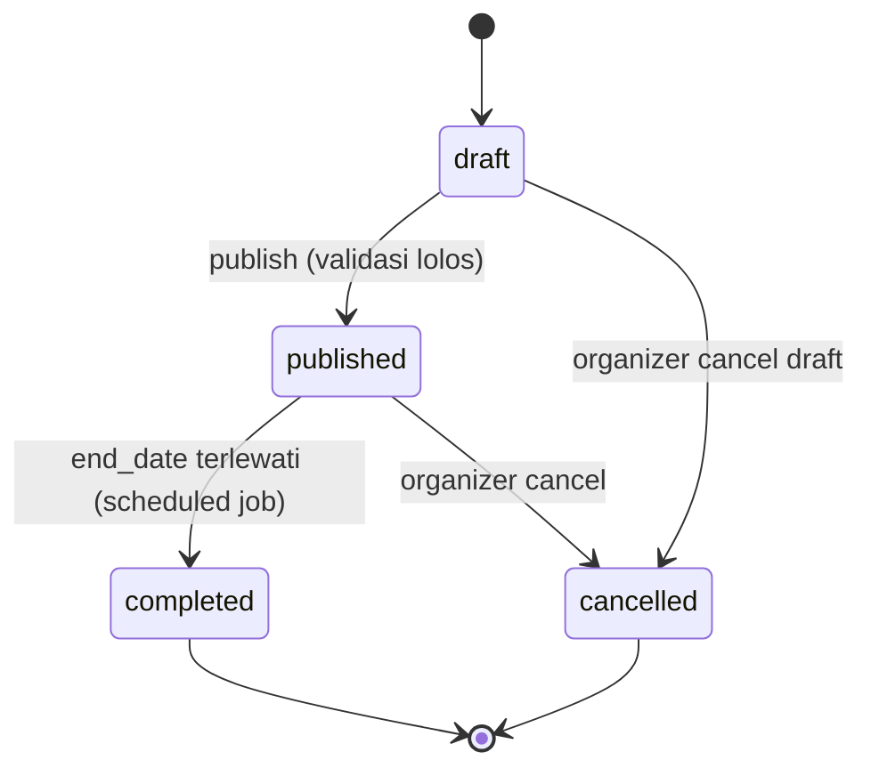
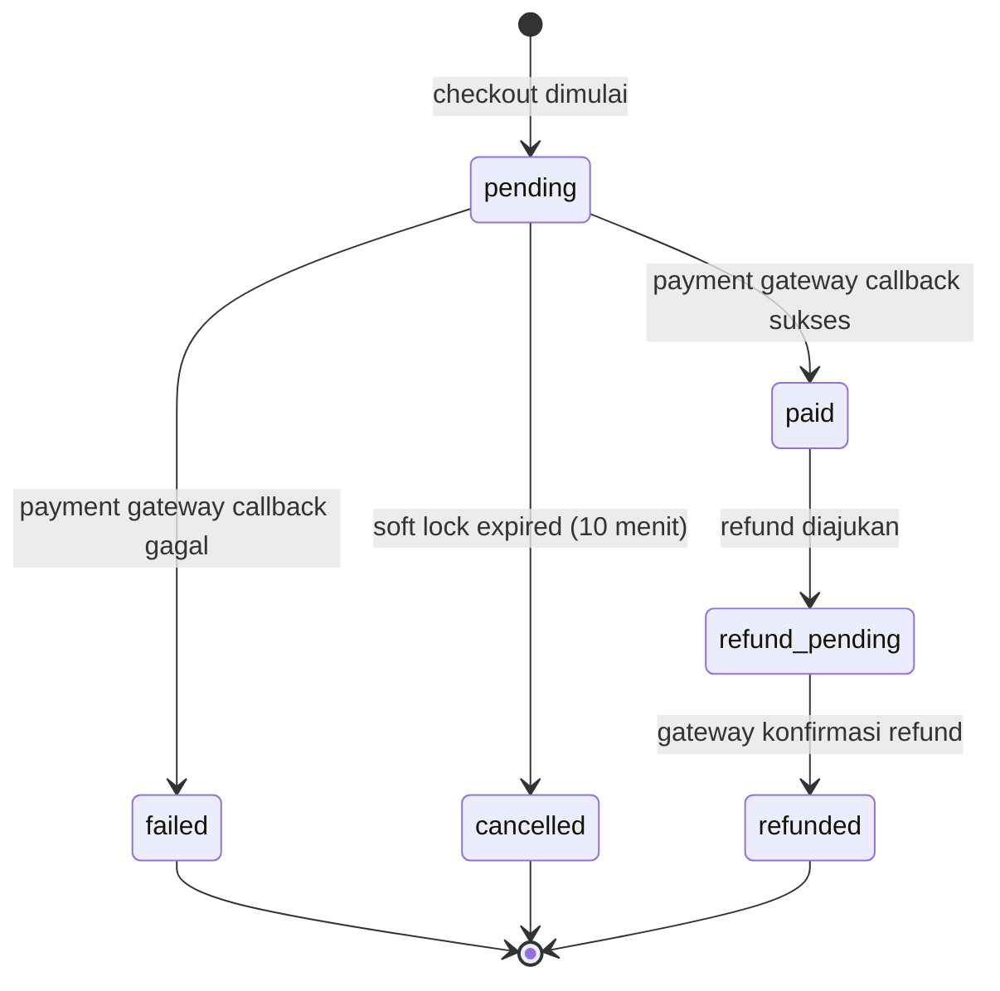
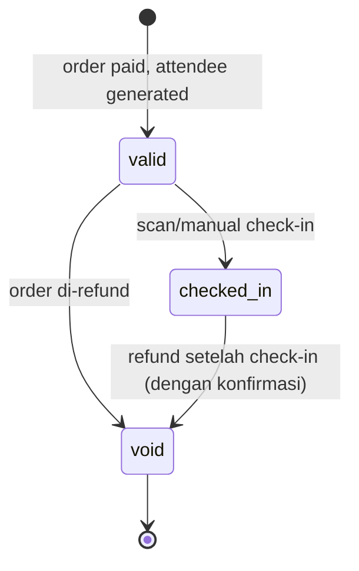

# EventHub — Data Model (Release 1 / MVP)

Companion document to `EventHub_PRD.md`. Semua tipe currency (`price`, `amount`, `balance`) disimpan sebagai **integer dalam satuan terkecil (sen/rupiah bulat)** untuk menghindari floating-point rounding error, sesuai NFR di PRD Section 17.

## Full ERD

## Entity Definitions

### User
| Field | Type | Notes |
|---|---|---|
| id | UUID (PK) | |
| email | string | unique, indexed |
| password_hash | string, nullable | null jika daftar via Google SSO saja |
| google_id | string, nullable | unique jika ada |
| full_name | string | |
| email_verified_at | timestamp, nullable | |
| created_at / updated_at | timestamp | |

### Organization
| Field | Type | Notes |
|---|---|---|
| id | UUID (PK) | |
| name | string | |
| category | string, nullable | misal "Tech Conference", "Music Festival" |
| logo_url | string, nullable | |
| payout_balance | integer (Rupiah) | default 0, hasil settlement dikurangi payout dicairkan |
| created_at / updated_at | timestamp | |

### OrganizationMember
| Field | Type | Notes |
|---|---|---|
| id | UUID (PK) | |
| organization_id | UUID (FK → Organization) | |
| user_id | UUID (FK → User) | |
| role | enum(`owner`,`admin`,`event_manager`,`finance`,`marketing`,`checkin_staff`,`content_manager`) | strict 1 role — lihat Business Rule PRD Section 18 |
| created_at | timestamp | |
| **Unique constraint** | (organization_id, user_id) | satu user hanya 1 membership per organisasi |

### Invite
| Field | Type | Notes |
|---|---|---|
| id | UUID (PK) | |
| organization_id | UUID (FK) | |
| email | string | |
| role | enum | sama seperti OrganizationMember.role |
| token | string | unique, untuk link accept |
| status | enum(`pending`,`accepted`,`expired`,`revoked`) | |
| expires_at | timestamp | default 7 hari |
| created_at | timestamp | |

### Subscription
| Field | Type | Notes |
|---|---|---|
| id | UUID (PK) | |
| organization_id | UUID (FK, unique) | 1:1 dengan Organization |
| tier | enum(`free`,`pro`,`enterprise`) | |
| status | enum(`active`,`past_due`,`cancelled`) | |
| current_period_start / current_period_end | timestamp | |
| payment_method_id | string, nullable | reference ke gateway (Midtrans/Xendit token) |
| created_at / updated_at | timestamp | |

### Invoice
| Field | Type | Notes |
|---|---|---|
| id | UUID (PK) | |
| subscription_id | UUID (FK) | |
| amount | integer (Rupiah) | |
| status | enum(`paid`,`pending`,`failed`) | |
| period_start / period_end | timestamp | |
| paid_at | timestamp, nullable | |

### Settlement
| Field | Type | Notes |
|---|---|---|
| id | UUID (PK) | |
| organization_id | UUID (FK) | |
| event_id | UUID (FK, nullable) | settlement bisa per event |
| gross_amount | integer (Rupiah) | total GMV event tsb |
| commission_amount | integer (Rupiah) | dipotong sesuai Assumption 5 PRD |
| net_amount | integer (Rupiah) | gross - commission, ditambahkan ke payout_balance |
| processed_at | timestamp | |

### Event
| Field | Type | Notes |
|---|---|---|
| id | UUID (PK) | |
| organization_id | UUID (FK) | |
| venue_id | UUID (FK, nullable) | null jika online-only |
| name | string | |
| description | text | |
| category | string, nullable | |
| cover_image_url | string, nullable | |
| event_type | enum(`in_person`,`online`,`hybrid`) | |
| online_link | string, nullable | wajib jika event_type online/hybrid |
| start_date / end_date | timestamp | |
| status | enum(`draft`,`published`,`completed`,`cancelled`) | |
| created_at / updated_at | timestamp | |

### Venue
| Field | Type | Notes |
|---|---|---|
| id | UUID (PK) | |
| organization_id | UUID (FK) | reusable antar event dalam 1 organisasi |
| name | string | |
| address | text | |
| capacity | integer, nullable | |
| latitude / longitude | float, nullable | dari Google Maps API |

### EventSession
| Field | Type | Notes |
|---|---|---|
| id | UUID (PK) | |
| event_id | UUID (FK) | |
| title | string | |
| description | text, nullable | |
| start_time / end_time | timestamp | |

### Speaker
| Field | Type | Notes |
|---|---|---|
| id | UUID (PK) | |
| organization_id | UUID (FK) | reusable antar event |
| name | string | |
| title | string, nullable | jabatan |
| company | string, nullable | |
| photo_url | string, nullable | |
| social_links | JSON, nullable | `{twitter, linkedin, instagram}` |

### EventSpeaker (join Speaker ↔ Event)
| Field | Type | Notes |
|---|---|---|
| event_id | UUID (FK) | |
| speaker_id | UUID (FK) | |
| **PK** | (event_id, speaker_id) | |

### SessionSpeaker (join Speaker ↔ EventSession)
| Field | Type | Notes |
|---|---|---|
| session_id | UUID (FK) | |
| speaker_id | UUID (FK) | |
| **PK** | (session_id, speaker_id) | |

### TicketType
| Field | Type | Notes |
|---|---|---|
| id | UUID (PK) | |
| event_id | UUID (FK) | |
| name | string | misal "Early Bird", "VIP" |
| price | integer (Rupiah) | |
| quantity_total | integer | |
| quantity_sold | integer | default 0, atomic increment saat order paid |
| sale_start / sale_end | timestamp | |
| benefits | text, nullable | |
| refund_policy | text, nullable | |
| transferable | boolean | default false |
| status | enum(`upcoming`,`on_sale`,`sold_out`,`inactive`) | derived/cached dari quantity & waktu |
| created_at / updated_at | timestamp | |

### PromoCode
| Field | Type | Notes |
|---|---|---|
| id | UUID (PK) | |
| event_id | UUID (FK) | |
| code | string | unique per event |
| discount_type | enum(`percentage`,`fixed`) | |
| discount_value | integer | persen (1-100) atau Rupiah |
| usage_limit | integer | |
| usage_count | integer | default 0, atomic increment |
| per_user_limit | integer, nullable | |
| valid_until | timestamp | |
| created_at | timestamp | |

### PromoCodeTicketType (join)
| Field | Type | Notes |
|---|---|---|
| promo_code_id | UUID (FK) | |
| ticket_type_id | UUID (FK) | |
| **PK** | (promo_code_id, ticket_type_id) | |

### Order
| Field | Type | Notes |
|---|---|---|
| id | UUID (PK) | |
| event_id | UUID (FK) | |
| buyer_name | string | |
| buyer_email | string | |
| buyer_phone | string, nullable | |
| promo_code_id | UUID (FK, nullable) | |
| subtotal_amount | integer (Rupiah) | |
| discount_amount | integer (Rupiah) | default 0 |
| total_amount | integer (Rupiah) | |
| status | enum(`pending`,`paid`,`failed`,`cancelled`,`refund_pending`,`refunded`) | |
| payment_method | string, nullable | |
| payment_gateway_ref | string, nullable | |
| idempotency_key | string | unique, lihat FR-SYS-5 |
| created_at / updated_at | timestamp | |

### OrderItem
| Field | Type | Notes |
|---|---|---|
| id | UUID (PK) | |
| order_id | UUID (FK) | |
| ticket_type_id | UUID (FK) | |
| unit_price | integer (Rupiah) | **snapshot** harga saat dibeli, tidak berubah walau TicketType.price berubah kemudian |
| quantity | integer | |

### Attendee
| Field | Type | Notes |
|---|---|---|
| id | UUID (PK) | |
| order_item_id | UUID (FK) | |
| event_id | UUID (FK, denormalized untuk query cepat) | |
| ticket_type_id | UUID (FK, denormalized) | |
| name | string | default dari buyer, bisa diedit per-tiket jika beli untuk orang lain |
| email | string | |
| qr_code | string | unique, single-use |
| status | enum(`valid`,`checked_in`,`void`) | void jika order di-refund |
| created_at | timestamp | |

### CheckIn
| Field | Type | Notes |
|---|---|---|
| id | UUID (PK) | |
| attendee_id | UUID (FK, unique) | 1:1 |
| event_id | UUID (FK, denormalized) | |
| checked_in_by | UUID (FK → User, nullable) | staff yang scan; null jika self-service (Future) |
| checkin_method | enum(`qr`,`manual`) | |
| device_id | string, nullable | untuk audit offline sync |
| scanned_at | timestamp | waktu aktual di device (bisa offline) |
| synced_at | timestamp | waktu data sampai ke server |
| is_offline_sync | boolean | default false |

### Notification
| Field | Type | Notes |
|---|---|---|
| id | UUID (PK) | |
| user_id | UUID (FK) | |
| organization_id | UUID (FK) | untuk scoping multi-org |
| category | enum(`order`,`ticket_inventory`,`billing`,`team`,`refund`,`event_capacity`) | |
| payload | JSON | konten dinamis (event_id, order_id, dst) |
| read_at | timestamp, nullable | |
| created_at | timestamp | |

### NotificationPreference
| Field | Type | Notes |
|---|---|---|
| user_id | UUID (FK) | |
| category | enum | sama seperti Notification.category |
| enabled | boolean | default true; kategori `billing`/`refund` tidak bisa dimatikan (enforced di application layer) |
| **PK** | (user_id, category) | |

## State Machines

### Event lifecycle

### Order lifecycle

### Attendee / ticket lifecycle

## Indexing Notes

- `Event.organization_id`, `Event.status` — composite index untuk query "My Events" per status.
- `Attendee.event_id`, `Attendee.name`, `Attendee.email` — untuk search performant (Feature 9).
- `Order.event_id`, `Order.status`, `Order.created_at` — untuk list Orders dengan filter & sort.
- `TicketType.event_id`, `TicketType.sale_start`, `TicketType.sale_end` — untuk menentukan status on_sale/upcoming secara efisien.
- `Notification.user_id`, `Notification.read_at` — untuk unread count cepat.
- Semua foreign key ke `organization_id` (langsung atau transitif via `event_id`) **wajib** dipakai sebagai row-level security filter di setiap query (lihat FR-SYS-1, PRD Section 16).
