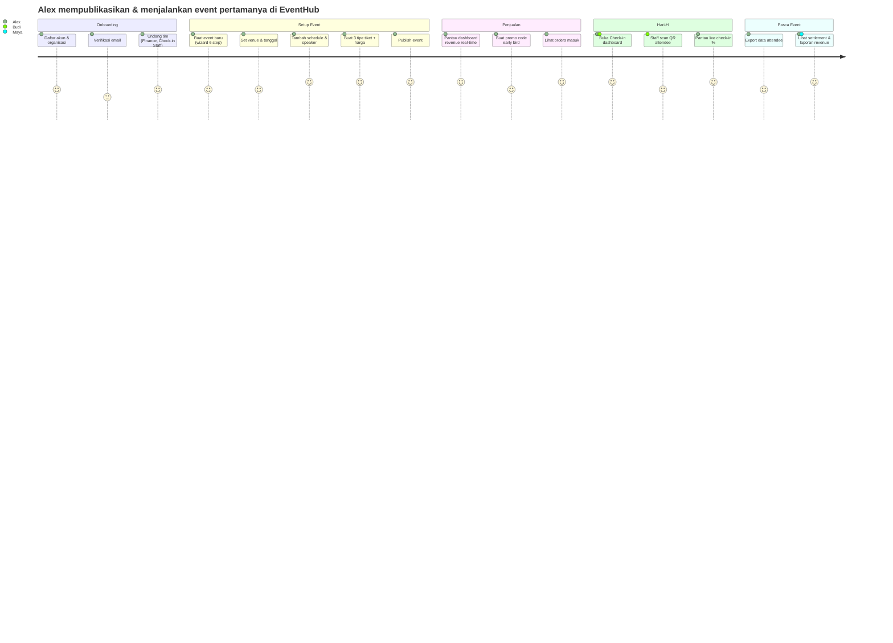
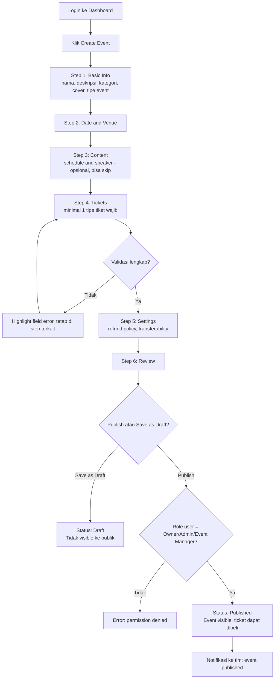
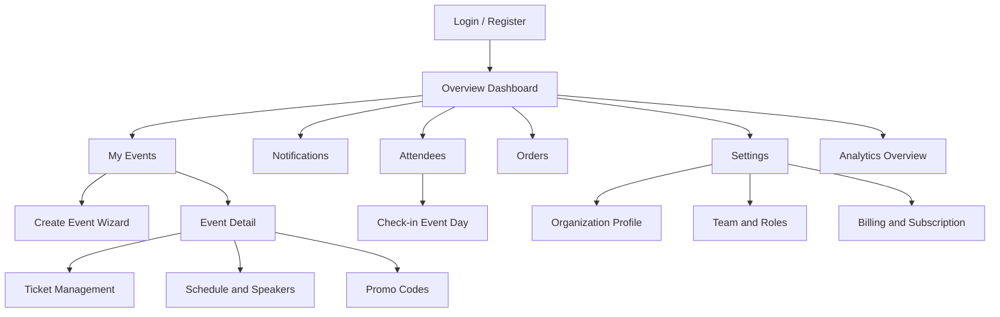
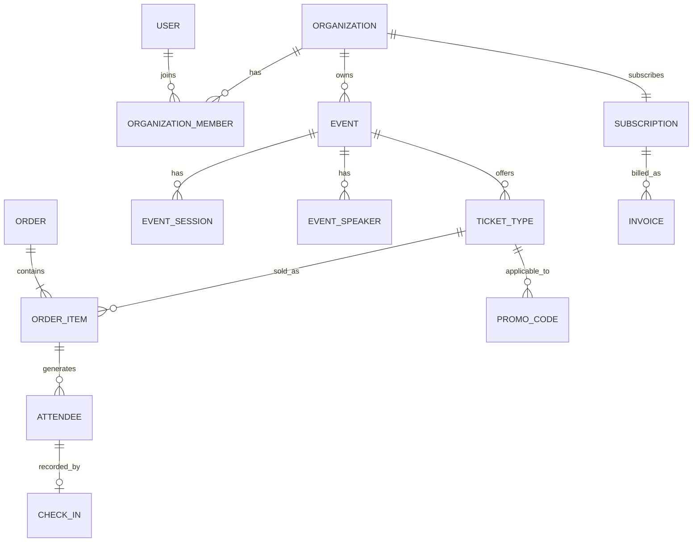
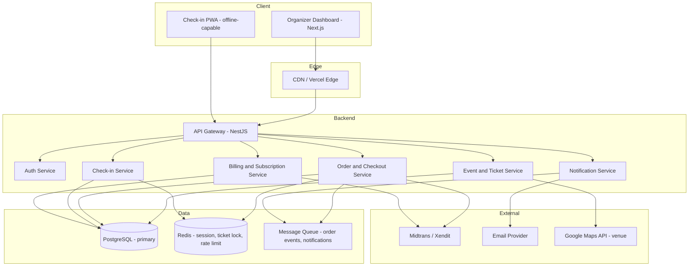

# Product Requirements Document — EventHub Organizer Platform

| | |
|---|---|
| **Product** | EventHub — Organizer Dashboard (multi-tenant SaaS) |
| **Version** | 1.0 (MVP / Release 1) |
| **Author** | AI-generated (Claude) — reviewed by: *[stakeholder name]* |
| **Date** | 10 Agustus 2026 |
| **Status** | Draft |
| **Companion docs** | `EventHub_Features.md` (feature spec), `EventHub_DataModel.md` (ERD & schema), `EventHub_APISpec.md` (endpoint table) |

---

## 1. Executive Summary

EventHub adalah platform SaaS multi-tenant yang memungkinkan event organizer (EO) — dari komunitas kecil sampai perusahaan MICE — mengelola seluruh siklus hidup event dalam satu dashboard: dari pembuatan event, ticketing, penjualan, manajemen attendee, check-in di hari-H, sampai analisis pendapatan. Alih-alih organizer memakai kombinasi spreadsheet, WhatsApp group, dan 2-3 tools ticketing terpisah, EventHub menyatukan semuanya jadi satu "Organizer Operating System" dengan model bisnis subscription + komisi per tiket terjual.

Release 1 (MVP) fokus pada jalur kritis yang harus ada sebelum organizer bisa benar-benar menjual tiket dan mengelola attendee secara mandiri: onboarding organisasi, manajemen tim & role, event & ticketing, checkout & pembayaran, attendee & check-in, serta analytics dasar. Modul yang lebih "growth" (marketing campaign, community, sponsor/vendor management, AI Event Health Score) didorong ke Phase 2 setelah core loop tervalidasi.

## 2. Business Background

Dokumen konsep awal (lihat lampiran sumber) memetakan EventHub sebagai ekosistem tiga produk: **Consumer App** (~30-40 screen, untuk pembeli tiket), **Organizer Dashboard** (~50-70 screen, subjek PRD ini), dan **Admin Dashboard** (~30-40 screen, internal EventHub untuk mengelola tenant/organizer). PRD ini secara spesifik membahas **Organizer Dashboard**, dengan asumsi Consumer App dan Admin Dashboard adalah produk terpisah yang berbagi backend/data model yang sama, dan akan mendapat PRD masing-masing.

> **ASSUMPTION:** Consumer App (halaman publik pembelian tiket) dan Admin Dashboard (internal EventHub) di luar scope dokumen ini, tapi API checkout & data model di sini dirancang supaya bisa dikonsumsi oleh Consumer App tanpa perubahan besar. — *Karena user brief fokus ke "dashboard event", bukan storefront publik. Kalau ternyata storefront-nya juga perlu dibangun bareng, itu perlu PRD terpisah yang di-link dari sini.*

## 3. Problem Statement

Organizer event skala kecil-menengah di Indonesia umumnya:

1. Menjual tiket lewat beberapa platform berbeda (atau manual transfer + Excel) → data attendee tercecer, sulit direkonsiliasi.
2. Koordinasi tim (finance, marketing, check-in staff) lewat WhatsApp → tidak ada audit trail, rawan human error saat hari-H.
3. Tidak punya visibilitas real-time terhadap penjualan, sehingga keputusan (misal: buka ticket tier baru, extend early bird) diambil terlambat.
4. Proses check-in di hari-H manual (coret nama di kertas / cek Excel) → antrean panjang, data kehadiran tidak akurat.

**Skenario konkret:** Seorang Event Manager di komunitas desain menyiapkan konferensi 3.000 peserta. Ia butuh 3 tier tiket dengan periode sale berbeda, ingin finance-nya bisa lihat revenue tanpa akses edit event, dan butuh 5 staff bisa scan QR code bersamaan saat hari-H tanpa internet stabil. Hari ini itu berarti 4 tools berbeda (form tiket manual, spreadsheet shared, WhatsApp broadcast, aplikasi QR scanner pihak ketiga) yang tidak saling terhubung.

## 4. Business Goals

- **Akuisisi organizer**: 200 organisasi aktif (≥1 event terpublikasi) dalam 6 bulan pertama pasca-launch.
- **Monetisasi**: kombinasi subscription tier (Free/Pro/Enterprise) + komisi per tiket terjual (target blended take rate 3-5%).
- **Retensi**: organizer yang sudah publish 1 event membuat event kedua dalam 90 hari (indikator core loop bekerja).
- **Efisiensi operasional organizer**: mengurangi waktu setup event dari (estimasi) berhari-hari (multi-tools) jadi < 30 menit untuk event sederhana di EventHub.

## 5. Success Metrics

| Metrik | Target Release 1 (90 hari pasca-launch) | Cara ukur |
|---|---|---|
| Organisasi baru mendaftar | 200 | Jumlah `Organization` created & verified |
| Event dipublikasikan | 350 | Jumlah `Event.status = published` |
| Tiket terjual via platform | 50.000 | Jumlah `OrderItem` dengan status `paid` |
| GMV (Gross Merchandise Value) tiket | Rp 5 miliar | SUM `Order.total_amount` status `paid` |
| Time-to-publish event pertama | Median < 30 menit dari `Organization` created ke `Event.status = published` pertama | Event log timestamp diff |
| Check-in success rate hari-H | > 95% attendee ter-check-in tanpa error sistem | `CheckIn` record vs `Attendee` expected |
| Checkout conversion rate | > 60% dari checkout dimulai ke pembayaran sukses | Funnel: `checkout_started` → `payment_succeeded` |

## 6. Scope (Release 1 / MVP)

Modul yang **dibangun** di Release 1 (detail lengkap di `EventHub_Features.md`):

1. Auth & Organization Onboarding
2. Team & Role Management (Permission)
3. Subscription & Billing (untuk organizer, bukan attendee)
4. Event Management (Create/Edit/Publish, Date & Venue, Draft)
5. Event Content — Schedule & Speaker
6. Ticket Management (tipe tiket, harga, kuota, periode sale)
7. Promo Codes / Discount
8. Checkout & Order Management (termasuk refund)
9. Attendee Management
10. Check-in (event day, QR + manual + offline mode)
11. Analytics Overview (revenue, ticket sales, funnel dasar)
12. Notification Center (in-app, sistem)

## 7. Out of Scope (Release 1)

| Modul | Alasan ditunda |
|---|---|
| Marketing Campaign (email/push/social) | Butuh integrasi Mailchimp/Meta yang tidak launch-blocking; core loop (jual tiket, kelola attendee) harus tervalidasi dulu |
| Community (post, comment, broadcast, poll) | Fitur engagement, bukan transaksional inti — risiko over-engineering sebelum ada basis attendee aktif |
| Sponsor Management | Relevan untuk event besar/korporat; volume awal organizer diperkirakan event kecil-menengah |
| Vendor Management | Sama seperti Sponsor Management — operasional back-office, bukan penghambat penjualan tiket |
| Audience Segmentation lanjutan (behavior-based) | Butuh data historis attendee yang baru terkumpul setelah beberapa event berjalan |
| Event Health Score (AI insight) | Butuh baseline data dari banyak event untuk scoring bermakna; dibangun setelah data cukup |
| Advanced Audience Analytics (age, lokasi, interest breakdown) | Analytics Overview (dasar) cukup untuk Release 1; breakdown demografis butuh data attendee profile yang lebih lengkap |
| Integrasi Google Calendar, Mailchimp, Meta, Slack | Nice-to-have, tidak menghalangi organizer menjual tiket & check-in attendee |
| Event Templates & Duplicate Event | Convenience feature, bisa disusulkan setelah pola pemakaian event nyata terlihat |
| Consumer-facing storefront (halaman publik beli tiket) | Produk terpisah, lihat Section 2 |
| Admin Dashboard internal EventHub | Produk terpisah, lihat Section 2 |

## 8. Assumptions

> **ASSUMPTION 1 — Nama produk & problem statement:** Ditetapkan berdasarkan konteks dokumen sumber; belum divalidasi riset user langsung. Jika stakeholder punya nama/problem statement berbeda, ganti di Section 1/3 — tidak mengubah arsitektur.

> **ASSUMPTION 2 — Payment gateway:** Midtrans (primary) + Xendit (fallback), karena target pasar Indonesia. Jika target pasar ternyata regional/global, Stripe perlu ditambahkan sebagai gateway ketiga — akan menambah kompleksitas currency handling.

> **ASSUMPTION 3 — Hosting & stack:** Next.js/Vercel + NestJS/PostgreSQL/Prisma/AWS. Tim eng existing tidak disebutkan preferensinya — kalau tim sudah punya stack (misal Laravel/Go), stack ini bisa diganti tanpa mengubah requirement fungsional.

> **ASSUMPTION 4 — Subscription tier detail:** Struktur tier (Free/Pro/Enterprise) dan harga belum ditentukan stakeholder. Diasumsikan 3 tier dengan batasan jumlah event aktif & fitur (lihat Section 19 Business Rules) — perlu divalidasi oleh tim bisnis/pricing sebelum launch, ini **bukan** keputusan teknis yang bisa didefault begitu saja.

> **ASSUMPTION 5 — Komisi per tiket:** Diasumsikan flat 3% dari harga tiket, dipotong otomatis saat settlement ke organizer. Angka ini perlu divalidasi tim bisnis — beda dengan kompetitor (Loket, Eventbrite berkisar 2-5%+fixed fee).

> **ASSUMPTION 6 — Offline check-in:** "Offline Mode" dari dokumen sumber diasumsikan berarti check-in app (PWA/mobile) bisa scan & queue check-in lokal saat tanpa internet, lalu sync saat koneksi kembali — bukan full offline-first architecture untuk seluruh dashboard.

## 9. Stakeholders

| Peran | Nama/Tim | Tanggung jawab |
|---|---|---|
| Product Owner | *[TBD]* | Approve scope, prioritas roadmap |
| Engineering Lead | *[TBD]* | Approve arsitektur teknis |
| Design Lead | *[TBD]* | Approve design system & UX flow |
| Business/Revenue | *[TBD]* | Validasi Assumption 4 & 5 (pricing, komisi) |
| QA Lead | *[TBD]* | Approve test strategy |
| Requested by | *[TBD — pemilik ide awal]* | — |

## 10. Personas

### Persona 1 — Alex, Event Manager (Owner role, komunitas/EO kecil)
- **Konteks:** Menjalankan 5-10 event/tahun (workshop, meetup, konferensi kecil 200-3000 peserta), tim 3-5 orang termasuk dirinya.
- **Goals:** Setup event cepat, kontrol penuh atas ticketing & harga, lihat revenue real-time, tidak mau ribet urusan teknis payment.
- **Frustrasi saat ini:** Rekonsiliasi manual pembayaran transfer bank, attendee komplain tiket hilang, staff check-in bingung pakai app yang berbeda-beda tiap event.

### Persona 2 — Maya, Finance (role Finance di organisasi menengah)
- **Konteks:** Bertanggung jawab atas laporan keuangan event, tidak terlibat di keputusan konten/marketing event.
- **Goals:** Akses cepat ke laporan revenue & settlement, tanpa harus punya akses edit event atau attendee data pribadi lebih dari yang perlu.
- **Frustrasi saat ini:** Harus minta export manual dari Event Manager, sering telat dapat data untuk closing bulanan.

### Persona 3 — Budi, Check-in Staff (role Check-in Staff, part-time saat hari-H)
- **Konteks:** Direkrut khusus untuk hari-H, tidak familiar dengan sistem, butuh onboarding instan (< 5 menit).
- **Goals:** Scan QR secepat mungkin, tahu status "sudah/belum check-in" tanpa ambigu, sistem tetap jalan walau WiFi venue lemot.
- **Frustrasi saat ini:** Aplikasi third-party terpisah dari data attendee resmi, sering ada double-entry atau data attendee yang beda antara guest list dan app scanner.

### Persona 4 — Sarah, calon Organizer (belum daftar — evaluasi platform)
- **Konteks:** Baru pertama kali jadi organizer, membandingkan beberapa platform ticketing.
- **Goals:** Coba gratis (Free tier), lihat apakah setup gampang, sebelum komit bayar subscription.
- **Frustrasi saat ini:** Platform lain butuh kontak sales untuk mulai, atau fee tersembunyi yang baru ketahuan saat settlement.

## 11. User Journey (Primary Persona: Alex, Event Manager)



## 12. User Flow — Key Task: "Buat & Publish Event Baru"



## 13. Information Architecture

```text
EVENTHUB ORGANIZER DASHBOARD (Release 1)
│
├── Overview                          → Section 16 Feature: Analytics Overview
│
├── EVENT MANAGEMENT
│   ├── My Events
│   ├── Create Event (wizard)
│   ├── Drafts
│   └── Event Detail
│       ├── Basic Info
│       ├── Date & Venue
│       ├── Schedule
│       └── Speakers
│
├── TICKETING
│   ├── Tickets
│   ├── Orders
│   └── Promo Codes
│
├── ATTENDEES
│   ├── All Attendees
│   └── Check-in (event day)
│
├── ANALYTICS
│   └── Overview (revenue, tickets, funnel)
│
├── NOTIFICATIONS
│
└── SETTINGS
    ├── Organization Profile
    ├── Team & Roles
    └── Billing & Subscription

── Phase 2 (lihat Section 7 & Roadmap Section 37) ──
├── MARKETING (Campaigns, Promotions, Email, Social)
├── COMMUNITY (Posts, Comments, Messages, Announcements)
├── SPONSORS
├── VENDORS
├── Event Health Score
└── Integrations (Google Calendar, Mailchimp, Meta, Slack)
```

## 14. Sitemap (Release 1)



**Estimasi jumlah screen Release 1:** ~22-26 screen (vs 50-70 screen untuk full vision di dokumen sumber) — konsisten dengan strategi phasing di Section 6/7.

## 15. Feature Breakdown

Lihat **`EventHub_Features.md`** untuk spesifikasi lengkap 12 fitur Release 1 (functional requirements, acceptance criteria, validation rules, error handling, edge case, permission, API requirement, database impact, analytics event, QA scenario per fitur).

Ringkasan prioritas:

| # | Fitur | Prioritas | Kompleksitas |
|---|---|---|---|
| 1 | Auth & Organization Onboarding | P0 | Medium |
| 2 | Team & Role Management | P0 | Medium |
| 3 | Subscription & Billing | P0 | High |
| 4 | Event Management | P0 | High |
| 5 | Event Content (Schedule & Speaker) | P1 | Low |
| 6 | Ticket Management | P0 | High |
| 7 | Promo Codes | P1 | Medium |
| 8 | Checkout & Order Management | P0 | High |
| 9 | Attendee Management | P0 | Medium |
| 10 | Check-in (Event Day) | P0 | High |
| 11 | Analytics Overview | P1 | Medium |
| 12 | Notification Center | P1 | Low |

P0 = blocking untuk launch minimal viable (organizer bisa jual tiket & check-in). P1 = penting tapi bisa nyusul 2-4 minggu setelah P0 live.

## 16. Functional Requirements (System-Level)

- FR-SYS-1: Sistem harus mendukung multi-tenancy penuh — setiap query data harus di-scope by `organization_id`; tidak ada cara bagi satu organisasi mengakses data organisasi lain melalui API manapun.
- FR-SYS-2: Semua aksi yang mengubah data finansial (order, refund, payout) harus tercatat di audit log dengan actor, timestamp, dan before/after state.
- FR-SYS-3: Sistem harus mengirim notifikasi in-app dan email untuk event kritikal (order baru, refund, tiket hampir habis, event mendekati kapasitas).
- FR-SYS-4: Public ticket purchase (checkout) harus tetap bisa diakses walau dashboard organizer down (dipisah secara arsitektur — lihat Section 27 System Architecture).
- FR-SYS-5: Sistem harus menyediakan idempotency key untuk seluruh endpoint yang membuat transaksi finansial (order, refund) untuk mencegah duplikasi akibat retry jaringan.

## 17. Non-Functional Requirements

| Kategori | Requirement |
|---|---|
| Performance | p95 API latency < 300ms untuk read endpoints, < 800ms untuk write/transaksional endpoints, pada 500 concurrent users |
| Scalability | Checkout flow harus tetap responsif pada lonjakan traffic saat flash sale/early bird dibuka (target: 1.000 checkout request/menit tanpa degradasi) |
| Availability | 99.5% uptime untuk dashboard, 99.9% untuk checkout & check-in service (dipisah dari dashboard core, lihat Section 27) |
| Security | Lihat Section 29 |
| Accessibility | WCAG 2.1 AA — lihat Section 30 |
| Data retention | Data attendee disimpan selama organisasi aktif + 2 tahun setelah event selesai untuk keperluan audit, kecuali ada permintaan hapus data (lihat Section 29 Security/Privacy) |
| Localization | Bahasa Indonesia & Inggris, mata uang IDR (default), format tanggal/waktu WIB dengan dukungan timezone lain untuk event non-Indonesia (Future) |
| Offline resilience | Check-in module harus tetap berfungsi (scan + local queue) hingga 30 menit tanpa koneksi internet, sync otomatis saat koneksi kembali |

## 18. Business Rules

| Area | Rule |
|---|---|
| Event publish | Event hanya bisa dipublish jika minimal 1 `TicketType` aktif dan `venue`/link online sudah diisi |
| Ticket sale period | `sale_start` harus < `sale_end`, dan `sale_end` tidak boleh lebih lambat dari `event.end_date` |
| Ticket inventory | Tidak boleh oversell — pembelian ditolak (409 Conflict) jika `quantity_sold >= quantity_total` pada saat transaksi diproses (row-level lock) |
| Promo code | Satu promo code hanya berlaku untuk tipe tiket yang di-assign eksplisit; tidak stackable dengan promo code lain dalam satu order |
| Refund | Refund hanya bisa diproses oleh role Owner/Admin/Finance; setelah refund, `Attendee` terkait otomatis di-void dan tidak bisa check-in |
| Role assignment | Strict satu role per user per organisasi (lihat Assumption/keputusan diskoveri); user yang sama bisa punya role berbeda di organisasi berbeda |
| Subscription limit | Free tier maksimal 1 event aktif & 100 tiket terjual/bulan; Pro tier unlimited event, fee komisi lebih rendah; Enterprise custom (lihat Assumption 4 — perlu validasi bisnis) |
| Check-in | Satu tiket (`Attendee`) hanya bisa check-in sekali; percobaan check-in kedua menampilkan warning "Already checked in at [waktu]" tanpa block staff (untuk menghindari kepanikan di lapangan), tapi tercatat sebagai `duplicate_attempt` di log |
| Commission settlement | Komisi platform (Assumption 5) dipotong otomatis dari setiap `Order` paid, sisa dana masuk `payout_balance` organizer, dicairkan sesuai jadwal settlement (default: T+7 setelah event selesai) |

## 19. Validation Rules (Ringkasan Global)

Detail lengkap per field ada di masing-masing fitur (`EventHub_Features.md`). Ringkasan lintas-fitur:

| Field | Rule | Pesan Error |
|---|---|---|
| Email (semua form) | Format valid RFC 5322, unique per `User` | "Format email tidak valid" / "Email sudah terdaftar" |
| Password | Min 8 karakter, kombinasi huruf & angka | "Password minimal 8 karakter, kombinasi huruf & angka" |
| Event date | `start_date` >= hari ini saat create (tidak boleh event di masa lalu), `end_date` >= `start_date` | "Tanggal event tidak valid" |
| Ticket price | >= 0, kelipatan Rp 1.000 | "Harga tiket harus kelipatan Rp1.000" |
| Ticket quantity | Integer > 0 | "Kuota tiket harus lebih dari 0" |
| Promo discount | 0-100% jika percentage, atau > 0 jika fixed amount, tidak melebihi harga tiket | "Diskon tidak valid" |

## 20. Edge Cases (Konsolidasi)

- Dua staff check-in scan QR code attendee yang sama dalam waktu bersamaan (race condition) → hanya satu yang tercatat sebagai check-in valid, staff kedua melihat "Already checked in".
- Organizer mengubah harga tiket setelah ada order pending (belum paid) → order pending tetap pakai harga saat dibuat (price snapshot di `OrderItem`), tidak terpengaruh perubahan harga tiket terbaru.
- Ticket sold out saat user sedang di tengah proses checkout (race condition antar buyer) → sistem reserve kuota selama 10 menit saat checkout dimulai (soft lock), rilis otomatis jika tidak selesai bayar.
- Organisasi downgrade subscription saat event aktif melebihi limit tier baru → event existing tetap jalan, hanya pembuatan event baru yang diblokir sampai sesuai limit.
- Refund diproses setelah attendee sudah check-in → sistem tetap proses refund tapi menampilkan warning ke Finance/Admin ("Attendee sudah check-in, konfirmasi refund?") sebelum eksekusi final.
- Check-in staff kehilangan koneksi internet total > 30 menit → data check-in lokal tetap tersimpan di device, muncul banner "X check-in belum tersinkron", auto-retry setiap koneksi terdeteksi.

## 21. Error Handling (Pendekatan Umum)

| Error class | HTTP Status | User-facing message | Retry policy |
|---|---|---|---|
| Validation error | 400 | Pesan spesifik per field (lihat tabel validasi) | Tidak retry otomatis, user perbaiki input |
| Permission denied | 403 | "Kamu tidak punya akses untuk aksi ini" | Tidak retry |
| Resource conflict (oversell, duplicate check-in) | 409 | Kontekstual (lihat per fitur) | Tidak retry otomatis |
| Payment gateway timeout | 504 (internal) → 202 ke user | "Pembayaran sedang diproses, kami akan update statusnya" | Sistem poll status ke gateway, retry 3x dengan exponential backoff sebelum mark failed |
| Server error | 500 | "Terjadi kesalahan, tim kami sudah diberi tahu" + Sentry alert | Auto-retry untuk operasi idempotent (read), tidak untuk write |
| Network error (client, termasuk check-in offline) | — | Banner offline mode, queue action lokal | Auto-sync saat koneksi kembali |

## 22. Permission Matrix

| Resource / Action | Owner | Admin | Event Manager | Finance | Marketing | Check-in Staff | Content Manager |
|---|:---:|:---:|:---:|:---:|:---:|:---:|:---:|
| Organization settings (edit) | ✅ | ✅ | ❌ | ❌ | ❌ | ❌ | ❌ |
| Team management (invite/remove) | ✅ | ✅ | ❌ | ❌ | ❌ | ❌ | ❌ |
| Billing & subscription | ✅ | ✅ | ❌ | 👁️ view only | ❌ | ❌ | ❌ |
| Create/edit event | ✅ | ✅ | ✅ | ❌ | ❌ | ❌ | ✏️ content only |
| Publish event | ✅ | ✅ | ✅ | ❌ | ❌ | ❌ | ❌ |
| Delete event | ✅ | ✅ | ❌ | ❌ | ❌ | ❌ | ❌ |
| Manage tickets & pricing | ✅ | ✅ | ✅ | 👁️ view only | ❌ | ❌ | ❌ |
| Create promo code | ✅ | ✅ | ✅ | ❌ | ✏️ (Phase 2) | ❌ | ❌ |
| View orders | ✅ | ✅ | ✅ | ✅ | ❌ | ❌ | ❌ |
| Process refund | ✅ | ✅ | ❌ | ✅ | ❌ | ❌ | ❌ |
| View attendees | ✅ | ✅ | ✅ | 👁️ (nama & status saja, tanpa kontak) | ❌ | 👁️ (hari-H saja) | ❌ |
| Export attendee data | ✅ | ✅ | ✅ | ❌ | ❌ | ❌ | ❌ |
| Check-in (scan/manual) | ✅ | ✅ | ✅ | ❌ | ❌ | ✅ | ❌ |
| View analytics/revenue | ✅ | ✅ | ✅ | ✅ | ❌ | ❌ | ❌ |
| Edit schedule/speaker | ✅ | ✅ | ✅ | ❌ | ❌ | ❌ | ✅ |

Legend: ✅ full access · 👁️ read-only (dibatasi field tertentu bila dicatat) · ✏️ edit terbatas ke resource spesifik · ❌ no access.

> Catatan resource-level: Finance hanya melihat data attendee minimal (nama, status bayar) — **tidak** melihat kontak pribadi (email/nomor telepon) attendee, untuk membatasi paparan data pribadi sesuai prinsip least-privilege (lihat Section 29 Security).

## 23. Database Design (Overview)

Entitas inti (skema lengkap & field-level di `EventHub_DataModel.md`):

- **Organization** — tenant root, punya `subscription_plan`, `payout_balance`.
- **User** — akun individu, bisa jadi member banyak `Organization` lewat `OrganizationMember`.
- **OrganizationMember** — join table User↔Organization dengan `role` (strict 1 role, lihat Business Rules).
- **Event** — milik satu `Organization`, punya `status` (draft/published/completed/cancelled), `venue`.
- **Venue** — bisa reusable antar event dalam organisasi yang sama.
- **EventSession** — jadwal/schedule item dalam satu event.
- **Speaker**, **EventSpeaker** — speaker profile & relasinya ke session/event.
- **TicketType** — tipe tiket dalam satu event (harga, kuota, periode sale).
- **PromoCode** — kode diskon, di-assign ke satu/lebih `TicketType`.
- **Order** — transaksi pembelian, dibuat oleh buyer (bisa guest, belum tentu punya akun EventHub).
- **OrderItem** — baris item dalam order, snapshot harga tiket saat dibeli, terhubung ke `TicketType`.
- **Attendee** — instance tiket individual (1 `OrderItem` bisa menghasilkan >1 `Attendee` jika beli beberapa tiket dalam satu jenis), punya QR code unik.
- **CheckIn** — record kehadiran, relasi 1:1 dengan `Attendee` (kalau sudah check-in).
- **Subscription**, **Invoice** — billing organizer ke EventHub.
- **Notification** — in-app notification per `User`.
- **AuditLog** — jejak aksi sensitif (lihat FR-SYS-2).

## 24. ERD (Ringkas — full di `EventHub_DataModel.md`)



## 25. API Design (Overview)

Lihat **`EventHub_APISpec.md`** untuk tabel endpoint lengkap (method, path, auth, request, response, error codes) per fitur. Konvensi umum:

- Base URL: `https://api.eventhub.io/v1`
- Auth: `Authorization: Bearer <JWT>` untuk endpoint dashboard (scoped ke `organization_id` dari token); endpoint checkout publik pakai session/guest token terpisah.
- Semua response error mengikuti format konsisten: `{ "error": { "code": "TICKET_SOLD_OUT", "message": "...", "details": {...} } }`.
- Pagination: cursor-based (`?cursor=...&limit=...`) untuk list endpoint bervolume tinggi (Orders, Attendees).

## 26. System Architecture



**Catatan desain:** `OrderSvc` (checkout) dipisah secara logis dari dashboard core supaya lonjakan traffic checkout (flash sale) tidak mengganggu performa dashboard organizer (lihat NFR Section 17). `CheckinSvc` dirancang mendukung offline queue di client (`CheckinApp`) yang sync ke server saat online.

## 27. Deployment Architecture

- **Environments:** `local` → `staging` → `production`. Staging pakai payment gateway sandbox (Midtrans/Xendit sandbox mode).
- **CI/CD:** GitHub Actions — lint & test on PR, auto-deploy `staging` on merge ke `develop`, manual approval untuk deploy `production` dari `main`.
- **Rollback:** Blue-green deployment di Vercel (frontend, instant rollback) dan versioned deployment di backend (rollback ke image sebelumnya via infra-as-code, target < 5 menit).
- **Database migration:** Prisma migration dijalankan sebagai step terpisah sebelum deploy backend baru, dengan backward-compatible migration policy (expand-contract pattern) supaya tidak ada downtime saat deploy.

## 28. Security

- **AuthN:** JWT access token (short-lived, 15 menit) + refresh token (httpOnly cookie, 7 hari), plus Google OAuth 2.0.
- **AuthZ:** Role-based, di-enforce di API layer (bukan cuma UI) — setiap request tervalidasi terhadap Permission Matrix (Section 22) dan `organization_id` scope (FR-SYS-1).
- **Data protection:** PII attendee (email, nomor telepon) di-encrypt at rest; akses field PII dibatasi sesuai Permission Matrix (contoh: Finance tidak lihat kontak attendee).
- **Payment security:** Tidak menyimpan data kartu kredit di sistem sendiri — sepenuhnya delegasi ke Midtrans/Xendit (PCI-DSS compliance ada di sisi gateway).
- **Threat spesifik produk ini:** Ticket scalping/bot checkout → rate limiting per IP/device di `OrderSvc`, CAPTCHA saat suspicious pattern terdeteksi. QR code attendee bisa di-screenshot & dishare → QR bersifat single-use, invalid otomatis setelah check-in pertama.
- **Audit:** Semua aksi finansial & permission-sensitive tercatat di `AuditLog` (FR-SYS-2), retained minimal 2 tahun.

## 29. Accessibility

Target **WCAG 2.1 Level AA** untuk dashboard organizer:
- Kontras warna minimal 4.5:1 untuk teks normal, 3:1 untuk teks besar/ikon interaktif.
- Semua form (Create Event wizard, dsb) bisa dioperasikan penuh via keyboard.
- QR scanner di Check-in module menyediakan fallback manual check-in (search nama) untuk device/kondisi yang tidak mendukung kamera.
- Komponen chart di Analytics menyediakan alternatif tabel data (bukan cuma visual) untuk screen reader.

## 30. Performance

Target sudah dicantumkan di Section 17 (NFR). Verifikasi:
- Load testing checkout flow sebelum tiap fitur besar launch (k6/Artillery), simulasi lonjakan flash-sale.
- Real User Monitoring (Sentry Performance atau setara) untuk p95 latency production.
- Query N+1 check otomatis di CI untuk endpoint list (Orders, Attendees) yang berpotensi volume tinggi.

## 31. Analytics (Event Taxonomy)

| Event | Trigger | Properties | Terhubung ke metric |
|---|---|---|---|
| `organization_created` | Signup organisasi selesai | `organization_id`, `signup_source` | Akuisisi organizer |
| `event_published` | Event status → published | `event_id`, `organization_id`, `time_to_publish_seconds` | Time-to-publish, Event dipublikasikan |
| `checkout_started` | User mulai checkout | `event_id`, `ticket_type_id`, `quantity` | Checkout conversion |
| `payment_succeeded` | Payment gateway callback sukses | `order_id`, `amount`, `payment_method` | GMV, Tiket terjual |
| `payment_failed` | Payment gateway callback gagal | `order_id`, `failure_reason` | Checkout conversion (denominator) |
| `attendee_checked_in` | Check-in berhasil (online/offline sync) | `attendee_id`, `event_id`, `checkin_method` (qr/manual), `is_offline_sync` | Check-in success rate |
| `subscription_upgraded` | Organizer ganti tier | `organization_id`, `from_tier`, `to_tier` | Monetisasi |

## 32. Logging & Monitoring

- **Application logs:** Structured JSON logs (correlation ID per request) dikirim ke centralized logging (misal Datadog/CloudWatch).
- **Error tracking:** Sentry untuk seluruh service backend & frontend.
- **Alerting thresholds:** Checkout error rate > 2% dalam 5 menit → page on-call. Payment gateway callback delay > 2 menit → alert. Check-in service down saat ada event live hari itu → P1 alert.
- **Business dashboards:** Metrik Section 5 di-track di internal dashboard (bisa pakai Metabase/Looker terhubung read-replica).

## 33. QA Strategy

- **Unit test:** Business logic kritikal (pricing calculation, promo code validation, inventory lock) — target coverage 80%+ di service layer.
- **Integration test:** Setiap endpoint API terhadap DB test instance, termasuk permission matrix enforcement per role.
- **E2E test:** Flow kritis (Create Event → Publish → Checkout → Check-in) di-automate (Playwright), jalan di CI untuk setiap PR ke `main`.
- **Load test:** Checkout flow sebelum launch, dan sebelum event besar (>5000 tiket) live di production.
- **Regression:** Full E2E suite dijalankan sebelum tiap production release.

## 34. Test Cases (Representative — detail lengkap per fitur di `EventHub_Features.md`)

| Fitur | Happy path | Edge case | Negative case |
|---|---|---|---|
| Event Management | Create → fill semua step → publish sukses | Save as draft, lanjut edit besoknya | Publish tanpa ticket type → error jelas |
| Ticketing | Buat 3 tipe tiket, harga & kuota berbeda | Ubah harga saat ada order pending → order lama tidak terpengaruh | Set `sale_end` > `event.end_date` → validation error |
| Checkout | Beli 2 tiket Regular → payment sukses → attendee ter-generate | Tiket sold out di detik terakhir checkout → soft-lock expire, user lihat "sold out" | Payment gateway timeout → order pending, user dapat notifikasi status |
| Check-in | Scan QR valid → status checked-in | Dua staff scan bersamaan → hanya 1 valid, 1 dapat warning | Scan QR sudah void (refunded) → error jelas "Tiket sudah di-refund" |

## 35. Release Plan

| Fase | Isi | Target durasi (estimasi) |
|---|---|---|
| Alpha (internal) | 12 fitur P0+P1 selesai, dites internal dengan 2-3 event dummy | 8-10 minggu dev |
| Closed Beta | Onboarding 10-20 organizer terpilih, real event, feedback loop cepat | 3-4 minggu |
| Public Launch (Release 1) | Buka pendaftaran publik, Free/Pro tier aktif | Setelah Beta stabil (checkout error rate < 1%, tidak ada P1 bug terbuka) |
| Go/No-Go criteria | Checkout success rate > 95% di Beta, check-in offline-sync teruji di minimal 1 event nyata > 500 attendee, security review selesai | — |

## 36. Roadmap (Phase 2+)

1. **Marketing module** — email campaign, promo social, terhubung ke Mailchimp/Meta.
2. **Community module** — announcement, comment moderation, broadcast ke attendee.
3. **Sponsor & Vendor management** — untuk event skala korporat/MICE.
4. **Advanced Analytics** — audience demografi, behavior segmentation, sales funnel detail.
5. **Event Health Score** — AI-generated insight scoring berdasarkan data historis lintas event.
6. **Event Templates & Duplicate Event** — percepatan setup event berulang.
7. **Integrasi tambahan** — Google Calendar sync, Slack notification, WhatsApp Business API untuk notifikasi attendee.
8. **Consumer App** (jika belum dibangun terpisah) & **Admin Dashboard internal**.

## 37. Open Questions

1. Struktur & harga pasti subscription tier (Assumption 4) — butuh keputusan tim bisnis sebelum pricing page dibangun.
2. Persentase komisi final (Assumption 5) dan apakah komisi berbeda per tier subscription.
3. Apakah butuh dukungan multi-currency/multi-timezone di Release 1, atau cukup IDR/WIB dulu (saat ini diasumsikan cukup IDR/WIB, lihat NFR Localization).
4. Siapa yang memegang data attendee saat organizer churn/tutup akun — kebijakan retensi & portabilitas data perlu ditentukan (relevan untuk kepatuhan UU PDP).
5. Apakah Consumer App (storefront publik) dibangun paralel atau menyusul setelah Organizer Dashboard live — mempengaruhi urutan pembangunan API checkout.

## 38. Appendix

- **Sumber referensi konsep awal:** dokumen breakdown internal "EventHub — Organizer Dashboard" (diupload user, mencakup visi lengkap 50-70 screen).
- **Glossary:**
  - **GMV** — Gross Merchandise Value, total nilai transaksi tiket sebelum dipotong komisi.
  - **Soft lock** — reservasi sementara kuota tiket selama proses checkout berlangsung.
  - **Settlement** — pencairan dana ke organizer setelah dipotong komisi platform.
  - **Take rate** — persentase komisi yang diambil platform dari GMV.
